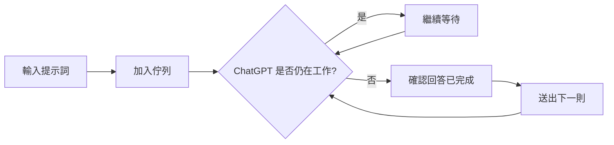

<div align="center">
  

# ChatGPT Queue Sender

**Firefox 上的 ChatGPT 訊息佇列助手**  
先排好提示詞，等待上一則回覆真正完成後，再安全地自動送出下一則。

[](#版本資訊)
[](https://addons.mozilla.org/zh-TW/firefox/addon/chatgpt%E4%BD%87%E5%88%97%E7%99%BC%E9%80%81/)
[](#安裝)
[](./manifest.json)
[](./BUILD.md)
[](./PRIVACY.md)

**本機佇列 · 回覆完成提醒 · 自訂提示語 · Markdown 匯出 · ZIP 封存 Beta · 對話交接**

### [🦊 從 Firefox Add-ons 安裝](https://addons.mozilla.org/zh-TW/firefox/addon/chatgpt%E4%BD%87%E5%88%97%E7%99%BC%E9%80%81/)

</div>

> [!NOTE]
> 這是針對 ChatGPT 網頁版製作的第三方 Firefox 擴充功能，並非 OpenAI 官方產品，也不需要 OpenAI API Key。

---

## 功能一覽

ChatGPT Queue Sender 會在 ChatGPT 輸入框的 **「+」旁邊**加入一個小型佇列按鈕。你可以先準備多則提示詞，擴充功能會透過原本的 ChatGPT composer 逐則送出，並在確認上一則回答已真正完成後才繼續。

| 功能 | 說明 |
| --- | --- |
| 📨 訊息佇列 | 最多 10 則待送提示詞，自動逐則處理 |
| 🔒 聊天室隔離 | 每個 conversation ID 使用獨立佇列，不會跨聊天室誤送 |
| 🗂️ 多分頁保護 | 同一聊天室多分頁時，只允許一個分頁持有發送租約 |
| 🛑 安全完成判定 | 避免 ChatGPT 還在 Thinking / Working / Running 時提早送出下一則 |
| ✏️ 佇列管理 | 編輯、刪除、排序、複製、停止、繼續與重試 |
| 🔔 完成提醒 | 可選提示音與 Firefox / 作業系統通知 |
| 💾 自訂提示語 | 常用提示語儲存在 Firefox 本機，可快速複製或送入目前聊天室 |
| 📝 Markdown 匯出 | 匯出目前顯示的對話分支 |
| 📦 完整 ZIP 封存 | Markdown + 使用者上傳 + ChatGPT 提供檔案 + 匯出報告 |
| 🔁 對話交接 | 產生可帶到新聊天室使用的結構化交接摘要 |
| 🌐 中英文介面 | 中文 Firefox 顯示中文，其他 Firefox 語言預設英文 |

---

## 為什麼需要它？

一般情況下，如果你一次有很多工作要交給 ChatGPT，需要等待上一則完成，再手動貼上下一則。

這個擴充功能把流程變成：



特別是在程式開發、工具執行或長回答中，ChatGPT 有時會先恢復 Send 按鈕，但背景工作仍在繼續。v0.8.6 加入更保守的完成判定，降低下一則訊息提早打斷工作的風險。

---

## v0.8.6 重點改進

### 更安全的「回答完成」判定

不再只依賴原生 Stop / Send 按鈕。

擴充功能會另外檢查最新 assistant turn 的：

- `aria-busy`、loading、pending、running 狀態
- progress / 工具 Stop / Cancel 控制
- Thinking、Working、Running、Reading、Writing、Editing、Testing 等動態工作狀態
- assistant 完成操作，例如 `copy-turn-action-button`
- 最新可見角色是否仍是尚未得到回答的 user message
- 回覆內容是否已穩定一段保守等待時間

如果 ChatGPT 的頁面結構改變、找不到明確完成控制，擴充功能會採用較保守的內容穩定回退，而不是立即送出下一則。

### 修正上傳圖片後佇列按鈕跑位

佇列按鈕現在會優先固定在：

```css
button[data-testid="composer-plus-btn"]
```

並排除圖片 / 附件預覽區中的 Remove、Delete、Close、Preview、Crop、Replace 等控制按鈕，因此上傳圖片或檔案後不應再把佇列按鈕錯誤插入預覽區。

### ZIP Beta 附件解析

目前可辨識多種 ChatGPT 附件來源，包括：

- `file ID`
- `asset ID`
- `sandbox:/mnt/data/...`
- `/mnt/data/...`
- URL encoded sandbox path
- 隱藏 tool / system 節點
- 沒有 `href`、只有 React metadata 的下載按鈕

同一附件若同時具有 ID 與 sandbox path，會合併並保留多種下載策略，降低漏抓與重複封存。

---

## 安裝

### 方法 A：Firefox Add-ons 官方商店（推薦）

ChatGPT Queue Sender 已正式上架 Firefox Add-ons，可直接從 Mozilla 官方商店安裝與接收後續更新。

**[🦊 前往 Firefox Add-ons 安裝 ChatGPT 佇列發送/批次發送](https://addons.mozilla.org/zh-TW/firefox/addon/chatgpt%E4%BD%87%E5%88%97%E7%99%BC%E9%80%81/)**

商店版本：**v0.8.6**

安裝後開啟或重新整理：

- `https://chatgpt.com/`
- `https://chat.openai.com/`

確認 ChatGPT 輸入框的 `+` 旁邊出現佇列按鈕即可。

> [!NOTE]
> Firefox Add-ons 頁面亦標示此擴充功能可用於 Firefox for Android。部分完整匯出、轉移與桌面操作流程仍以 Firefox Desktop 為主要測試環境。

### 方法 B：從原始碼暫時載入

適合開發、測試、除錯或自行檢查原始碼。一般使用者建議直接使用上方 Firefox Add-ons 正式版本。

1. 下載或 clone 此 repository。
2. 在 Firefox 開啟：

   ```text
   about:debugging#/runtime/this-firefox
   ```

3. 點擊 **Load Temporary Add-on / 載入暫時附加元件**。
4. 選擇 repository 根目錄中的 `manifest.json`。
5. 開啟或重新整理 ChatGPT。
6. 確認輸入框的 `+` 旁邊出現佇列按鈕。

> [!IMPORTANT]
> 暫時載入只適合開發與測試，Firefox 關閉後會失效。日常使用請安裝 Firefox Add-ons 商店正式版本。

### Firefox 版本

- Firefox Desktop：**140.0+**
- Firefox Android manifest 最低版本：**142.0+**
- Firefox Add-ons：**已正式上架**
- 匯出與轉移等介面目前仍以 Firefox 桌面版為主要支援／測試環境

---

## 基本使用方式

### 加入訊息佇列

1. 在 ChatGPT 輸入框輸入提示詞。
2. 點擊 `+` 旁邊的 **加入佇列** 按鈕。
3. 加入佇列即代表確認，不需要再按「開始」。
4. 如果 ChatGPT 正在工作，擴充功能會等待。
5. 上一則回答真正完成後，才會處理下一則。

你也可以用單獨一行：

```text
---
```

把輸入內容分成多則訊息後一次加入佇列。

### 管理佇列

右下角管理抽屜可用來：

- 查看目前待送內容
- 編輯
- 刪除
- 上移 / 下移
- 複製
- 停止後續發送
- 在適合的情況下繼續或重試
- 復原剛加入的訊息

重新整理頁面後，佇列、暫停狀態與已提交狀態仍會保留。

---

## 完成提醒

工具列 popup 可設定：

- 回覆完成提醒總開關
- 柔和提示音
- Firefox / 作業系統通知
- 只在離開目前 ChatGPT 分頁時提醒
- 測試提醒

`notifications` 是 **選用權限**，只有使用者主動開啟系統通知時才會要求。

---

## 自訂提示語

「匯出與轉移」選單也提供本機提示語庫：

- 最多儲存 30 則
- 自訂名稱與完整內容
- 編輯、刪除、排序
- 滑鼠移入後快速複製或發送
- 全聊天室共用提示語庫
- 實際發送時仍只會加入目前聊天室的佇列

資料保存在 Firefox WebExtension 本機 storage。

---

## 匯出與轉移

### Markdown 匯出

可以把目前 ChatGPT 顯示的對話分支匯出成 Markdown，保留常見內容結構，例如：

- User / ChatGPT 角色
- 訊息順序
- 標題
- 粗體與清單
- 引言
- 程式碼區塊與 inline code
- 表格
- 連結
- 圖片替代文字
- 可見附件資訊

### 完整對話 ZIP `Beta`

ZIP 封存會在本機建立，預期結構如下：

```text
聊天室名稱.zip
├── 聊天室名稱.md
├── 使用者上傳/
├── ChatGPT提供/
└── 匯出報告.txt
```

英文 Firefox 則使用：

```text
Conversation title.zip
├── Conversation title.md
├── User Uploads/
├── Provided by ChatGPT/
└── export-report.txt
```

匯出前可檢查附件清單，並依 `V1`、`V2`、`2.0`、`2.1`、`修改版`、`最終版`、`(1)`、`(2)` 等檔名資訊預設選擇較新的版本。

> [!WARNING]
> ZIP 封存仍標示為 **Beta**。舊附件可能因 HTTP 403、權限撤銷、簽名下載網址過期，或 ChatGPT 網頁結構改變而無法下載。單一附件失敗不會中止整份 ZIP，原因會寫入匯出報告。

### 對話交接摘要

擴充功能可以：

1. 顯示標準化交接指令供使用者預覽。
2. 允許修改內容。
3. 將交接指令排入目前聊天室佇列。
4. 回覆完成後提供快速複製交接摘要。

適合把長對話的專案狀態帶到新聊天室繼續。

---

## 聊天室與多分頁安全機制

佇列不是所有 ChatGPT 分頁共用的一份全域資料。

- 已建立聊天室：以 **conversation ID** 建立獨立 scope
- 尚未建立 conversation ID 的新聊天：使用目前 Firefox **tab ID** 建立 draft scope
- 同一聊天室同時開啟多個分頁：透過 `storage.session` 持久租約限制只有一個分頁可發送
- 切換聊天室：舊聊天室佇列保留，不會被帶到新聊天室送出
- 背景腳本短暫重新啟動：租約仍可恢復，降低多分頁重複發送風險

---

## 隱私與權限

ChatGPT Queue Sender：

- 不需要 OpenAI API Key
- 不使用開發者控制的遠端伺服器
- 不使用 analytics / telemetry / tracking
- 不含廣告 SDK
- 不載入遠端程式碼
- 不會把佇列或匯出的聊天內容傳送給開發者

必要權限：

```json
"permissions": ["storage"]
```

選用權限：

```json
"optional_permissions": ["notifications"]
```

附件封存需要存取 ChatGPT / OpenAI / oaiusercontent 控制的檔案主機。背景腳本只允許指定 OpenAI 相關 HTTPS 網域，其他網站會在程式層被拒絕。

完整說明請閱讀 **[PRIVACY.md](./PRIVACY.md)**。

---

## 開發環境

需求：

- Node.js **20+**
- npm **10+**

安裝依賴：

```bash
npm ci
```

執行完整驗證：

```bash
npm run verify
```

常用測試：

```bash
npm run check
npm run test:pure
npm run test:safety
npm run test:dom
npm run lint:amo
```

`npm run verify` 會組合語法 / 靜態檢查、模擬測試、jsdom UI 測試以及 Mozilla `addons-linter`。

更多資訊：

- **[BUILD.md](./BUILD.md)** — 建置與 XPI / source ZIP 封裝方式
- **[TESTING.md](./TESTING.md)** — 完整人工與自動測試清單
- **[VALIDATION_REPORT.md](./VALIDATION_REPORT.md)** — 目前版本的驗證結果

---

## 專案結構

```text
.
├── manifest.json
├── background.js
├── content.js
├── content.css
├── i18n.js
├── _locales/
│   ├── en/
│   ├── zh_CN/
│   └── zh_TW/
├── icons/
│   ├── icon-16.png
│   ├── icon-32.png
│   ├── icon-48.png
│   ├── icon-64.png
│   ├── icon-96.png
│   ├── icon-128.png
│   ├── icon-256.png
│   └── icon-512.png
├── popup/
│   ├── popup.html
│   ├── popup.css
│   └── popup.js
├── export/
│   ├── archive-export.js
│   ├── conversation-api.js
│   ├── conversation-export.js
│   ├── custom-prompts.js
│   ├── handoff-prompt.js
│   ├── markdown-converter.js
│   ├── zip-writer.js
│   └── export-ui.css
├── tests/
├── scripts/
├── BUILD.md
├── TESTING.md
├── PRIVACY.md
├── CHANGELOG.md
├── FIREFOX_STORE_LISTING.md
├── AMO_UPLOAD_NOTES.md
└── VALIDATION_REPORT.md
```

---

## 文件

| 文件 | 用途 |
| --- | --- |
| [BUILD.md](./BUILD.md) | 本機測試、建立 AMO XPI、建立 source ZIP |
| [TESTING.md](./TESTING.md) | 詳細測試案例與回歸檢查 |
| [PRIVACY.md](./PRIVACY.md) | 中英文隱私權政策 |
| [CHANGELOG.md](./CHANGELOG.md) | 版本變更紀錄 |
| [FIREFOX_STORE_LISTING.md](./FIREFOX_STORE_LISTING.md) | Firefox Add-ons 商店文案與權限說明 |
| [AMO_UPLOAD_NOTES.md](./AMO_UPLOAD_NOTES.md) | AMO 上傳注意事項 |
| [VALIDATION_REPORT.md](./VALIDATION_REPORT.md) | v0.8.6 驗證報告 |

---

## 已知限制

- ChatGPT 是持續更新的網頁應用，DOM / React 結構改變後可能需要更新 selector 或狀態判定。
- ZIP Beta 無法保證已失效、權限被撤銷或簽名網址已過期的舊附件仍可下載。
- 擴充功能不會繞過 ChatGPT 的登入、訂閱、模型存取、訊息額度或速率限制。
- 完整匯出 / 轉移介面目前主要以 Firefox 桌面版為測試目標。
- 暫時載入未簽署版本只適合開發與測試。

如果遇到問題，回報時建議附上：

1. Firefox 版本
2. 擴充功能版本
3. 發生問題的功能
4. 是否可重現
5. Console 錯誤（若有）
6. ZIP 問題請附 `匯出報告.txt` / `export-report.txt`，但請先確認內容中沒有不想公開的私人資訊

---

## 版本資訊

目前版本：**v0.8.6**  
Firefox Add-ons：**已正式上架** — [前往官方商店安裝](https://addons.mozilla.org/zh-TW/firefox/addon/chatgpt%E4%BD%87%E5%88%97%E7%99%BC%E9%80%81/)

近期重點：

- **v0.8.6** — 防止 ChatGPT 工具 / 程式工作尚未完成時誤送下一則；修正圖片上傳後佇列按鈕錯位
- **v0.8.5** — 補強 React 無 `href` 下載按鈕、sandbox-only 附件、hidden tool/system 附件解析
- **v0.8.4** — 完整對話 ZIP 加入 `Beta` 標籤
- **v0.8.2** — 多分頁租約、雙語介面與驗證流程補強
- **v0.7.0** — 自訂提示語庫
- **v0.6.0** — 完整對話 ZIP 封存
- **v0.5.0** — Markdown 匯出與對話交接
- **v0.4.0** — 回覆完成提醒

完整內容請看 **[CHANGELOG.md](./CHANGELOG.md)**。

---

## English Summary

**ChatGPT Queue Sender** is a local-first Firefox extension for the ChatGPT web interface. It is officially available on [Firefox Add-ons](https://addons.mozilla.org/zh-TW/firefox/addon/chatgpt%E4%BD%87%E5%88%97%E7%99%BC%E9%80%81/) and adds a conversation-scoped prompt queue, reusable saved prompts, completion alerts, Markdown export, a Beta ZIP conversation archive with selected attachments, and handoff tools.

The extension waits for the current ChatGPT response to actually finish before submitting the next queued prompt. v0.8.6 also guards against long coding/tool tasks where the native Send button may return before the assistant has fully completed its work.

Key points:

- Conversation-scoped local queues
- Multi-tab lease protection
- Conservative completion detection
- Saved prompt library
- Optional local sound/system notifications
- Markdown export
- ZIP archive Beta with attachment review and version selection
- Conversation handoff workflow
- Chinese UI for Simplified/Traditional Chinese Firefox; English for other Firefox UI languages
- No OpenAI API key
- Official Firefox Add-ons distribution
- No developer-controlled server
- No analytics or telemetry

See **[BUILD.md](./BUILD.md)** for development and packaging instructions and **[PRIVACY.md](./PRIVACY.md)** for the full privacy policy.

---

<div align="center">
  <sub>Built for a safer, more organized ChatGPT workflow on Firefox.</sub>
</div>
